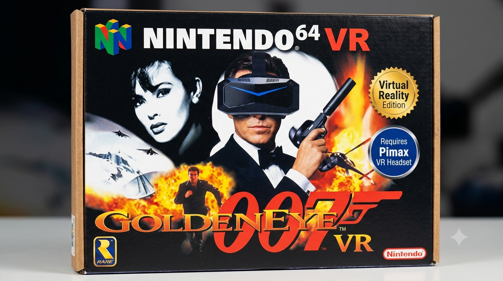

  

# GEVR - stand inside GoldenEye

**Native VR. Bring your own ROM. Beta is live.**

Not an emulator overlay. Not a flat game with a 3D wrapper. GEVR rebuilds GoldenEye on PC for real OpenXR stereo, 6DOF, and controller aim so you can actually *be* in the Facility.

[Play the Beta](https://github.com/no6969el/GEVR/releases/tag/vr420) | [Controls](docs/CONTROLS.md) | [Credits](CREDITS.md) | [Roadmap](docs/ROADMAP.md)

---

## The VR stuff that makes it feel like yours

**You are in the room**
Walk around your playspace and Bond walks with you. Turn your head - the world stays put. Recenter anytime with **both thumbstick clicks**. (This cut includes the playspace comfort pass so straying off your reset spot does not shear the gun and world when you look around.)

**The gun is in your hand**
Point the controller to aim. Trigger fires. Squeeze to ADS - the mark sits on the gun ray, not glued to your face. Casings leave the weapon. Haptics pulse when a round actually goes off.

**Hands do Bond things**
Punch / melee with your hands. Touch to use (doors, interact) by reaching instead of hunting a 2D prompt.

**Cinema that stays in the world**
Menus and intro cinema sit on a screen in a small hub room. Look left and right - the screen stays nailed in space; you are not wearing a billboard on your face.

**It looks like GoldenEye, in stereo**
True per-eye VR. Explosions and fire color. Intro gunbarrel drip. Title walk backdrop. File-backed images from *your* ROM (we never ship the cart).

**Then you play the campaign**
Facility and friends, OpenXR on PC. Mission Report / NEXT actually takes input after a stage clear. HUD and on-screen text pulled in off the HMD rim so you can read it.

---

## Honest Beta notes

- **Works today:** Pimax Crystal Super (Micro OLED) with **SteamVR as OpenXR** (including Pimax-as-SteamVR bridges). See [CONTROLS.md](docs/CONTROLS.md).
- **Not working yet (fixing):** native **PimaxXR**, and **Quest 3 + Virtual Desktop (VDXR)** (often attaches flat on the monitor). Please report those with runtime + HMD vs monitor.
- Crashes and rough edges are expected. That is why it is Beta.
- You bring a **USA GoldenEye `.z64` you own**. No ROM in the download.
- Full colocated Bond body, multiplayer, and a fancier hub room are later - see the [roadmap](docs/ROADMAP.md).

---

## Start

1. Grab the [vr420 Release zip](https://github.com/no6969el/GEVR/releases/tag/vr420)
2. Unzip. Use **`Start-GEVR.bat`**
3. Drop in your ROM when asked
4. Headset on. Recenter (both sticks). Enjoy

[How to play / recenter](docs/CONTROLS.md) - [Report a bug](https://github.com/no6969el/GEVR/issues/new/choose) - [Who we credit](CREDITS.md)
